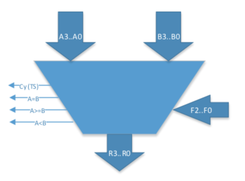
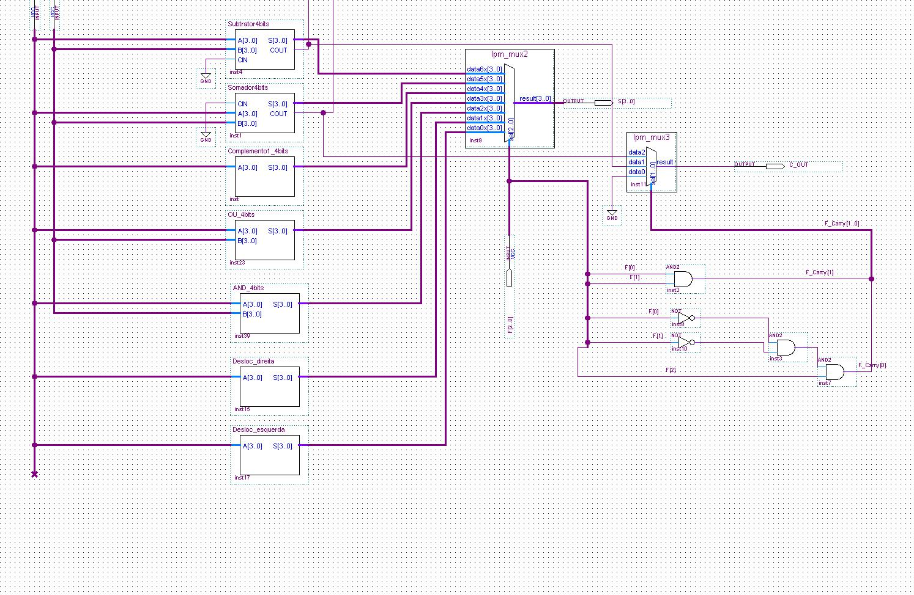

# ALU

OVERVIEW
--------------------------------------------------
The purpose of this project was to implement a 4 bit Arithmetic Logic Unit with the aid of Quartus Software for the [Introduction to Digital Logic] course. It was made at the Computer Science undergraduate program from University of São Paulo (ICMC - USP).

PROJECT
--------------------------------------------------
Design a 4-bit ULA, according to the structure given in the classroom, having the following functions:
0. Sum of two unsigned 4-bit integers (A + B);
1. Subtraction of two unsigned 4-bit integers (A-B);
2. Complement of 1 of A (A ');
3. OR Operation (A OR B);
4. AND operation (A AND B);
5. Offset to the right of A (with insertion of 0 in MSB);
6. Shift to the left of A (with insertion of 0 in LSB);
7. Comparison of A and B;

The project had to follow the diagram below:



HOW TO COMPILE
--------------------------------------------------
```bash
1. Install Quartus software 
2. Open the project file `ULA\ULA.qpf` and Compile it.
```

ALU
--------------------------------------------------


CREDITS
--------------------------------------------------
- Gustavo Mazzo
- Wesley Tiozzo

MORE INFO
--------------------------------------------------
* Please check the files: `project specification.pdf` and `project report.pdf` to read about this project.
